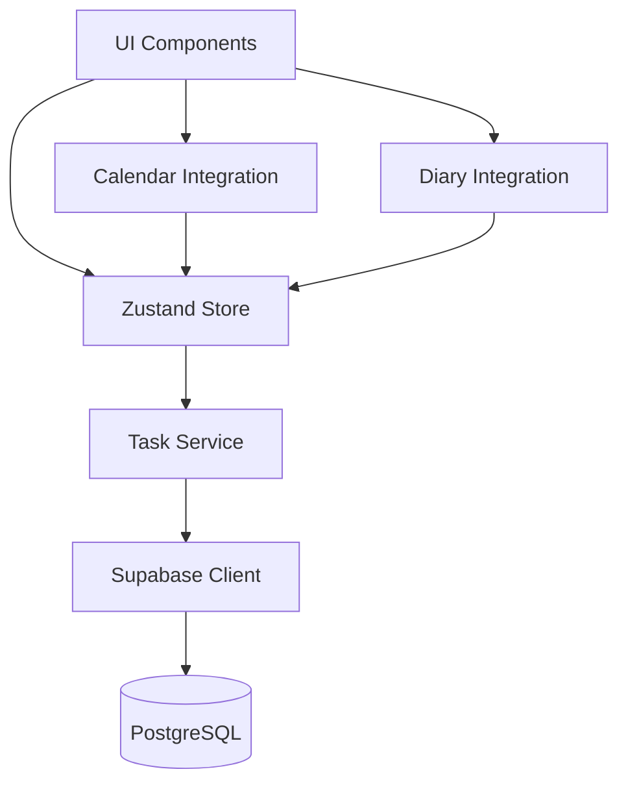
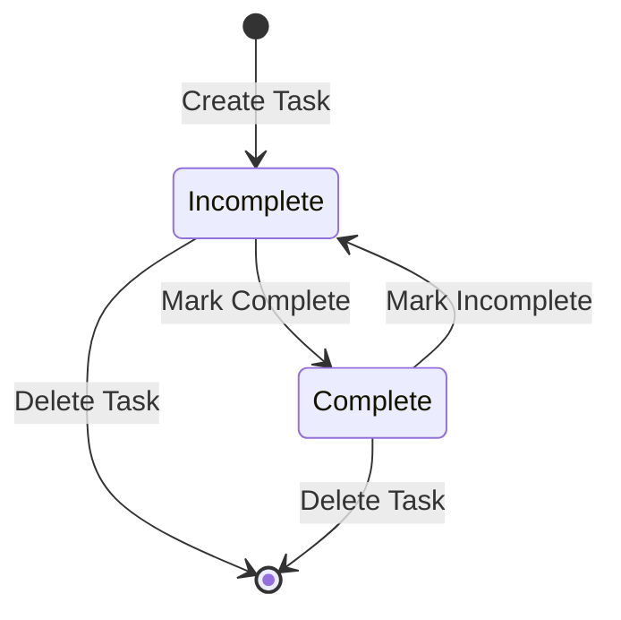

# Design Document: Workspace Todo Management

## Overview

The Workspace Todo Management system is a comprehensive task management feature integrated into an existing React-based diary application. The system provides users with tools to create, organize, prioritize, and track tasks while seamlessly integrating with existing diary entries and calendar views.

### Architecture Approach

The design follows a layered architecture pattern:
- **Presentation Layer**: React components with Zustand state management
- **Business Logic Layer**: Service classes for task operations and validation
- **Data Access Layer**: Supabase client with TypeScript types
- **Database Layer**: PostgreSQL with Row Level Security (RLS)

### Key Design Principles

1. **User Data Isolation**: All task data is scoped to authenticated users via RLS policies
2. **Optimistic UI Updates**: Immediate UI feedback with background persistence
3. **Responsive Design**: Mobile-first approach with progressive enhancement
4. **Accessibility First**: WCAG AA compliance throughout
5. **Bilingual Support**: i18n integration for Chinese/English
6. **Theme Consistency**: Seamless dark/light theme support
7. **Performance**: Lazy loading, caching, and virtual scrolling for large datasets

## Architecture

### System Components



### Component Responsibilities

**UI Components**:
- TaskList: Displays tasks in list format with filtering and sorting
- TaskKanban: Displays tasks in kanban board format with drag-and-drop
- TaskForm: Handles task creation and editing
- TaskCard: Displays individual task information
- TaskFilters: Provides filtering and search controls
- TaskStats: Displays productivity statistics
- CategoryManager: Manages task categories

**Zustand Store**:
- Manages global task state
- Handles optimistic updates
- Coordinates with Task Service for persistence
- Manages filter and view state
- Caches task data

**Task Service**:
- Encapsulates business logic
- Validates task data
- Interfaces with Supabase client
- Handles error recovery and retries
- Manages offline queue

**Supabase Client**:
- Provides database access
- Enforces RLS policies
- Handles authentication context
- Manages real-time subscriptions (optional)

## Components and Interfaces

### Database Schema

#### Tasks Table

```sql
CREATE TABLE tasks (
  id UUID PRIMARY KEY DEFAULT gen_random_uuid(),
  user_id UUID NOT NULL REFERENCES auth.users(id) ON DELETE CASCADE,
  title TEXT NOT NULL CHECK (length(trim(title)) > 0),
  description TEXT,
  priority TEXT NOT NULL DEFAULT 'medium' CHECK (priority IN ('high', 'medium', 'low')),
  status TEXT NOT NULL DEFAULT 'incomplete' CHECK (status IN ('complete', 'incomplete')),
  category_id UUID REFERENCES categories(id) ON DELETE SET NULL,
  due_date TIMESTAMPTZ,
  completed_at TIMESTAMPTZ,
  created_at TIMESTAMPTZ NOT NULL DEFAULT now(),
  updated_at TIMESTAMPTZ NOT NULL DEFAULT now()
);

CREATE INDEX idx_tasks_user_id ON tasks(user_id);
CREATE INDEX idx_tasks_due_date ON tasks(due_date) WHERE due_date IS NOT NULL;
CREATE INDEX idx_tasks_status ON tasks(status);
CREATE INDEX idx_tasks_category_id ON tasks(category_id) WHERE category_id IS NOT NULL;
```

#### Categories Table

```sql
CREATE TABLE categories (
  id UUID PRIMARY KEY DEFAULT gen_random_uuid(),
  user_id UUID NOT NULL REFERENCES auth.users(id) ON DELETE CASCADE,
  name TEXT NOT NULL CHECK (length(trim(name)) > 0),
  color TEXT,
  created_at TIMESTAMPTZ NOT NULL DEFAULT now(),
  updated_at TIMESTAMPTZ NOT NULL DEFAULT now(),
  UNIQUE(user_id, name)
);

CREATE INDEX idx_categories_user_id ON categories(user_id);
```

#### Task-Diary Links Table

```sql
CREATE TABLE task_diary_links (
  id UUID PRIMARY KEY DEFAULT gen_random_uuid(),
  task_id UUID NOT NULL REFERENCES tasks(id) ON DELETE CASCADE,
  diary_entry_id UUID NOT NULL REFERENCES diary_entries(id) ON DELETE CASCADE,
  created_at TIMESTAMPTZ NOT NULL DEFAULT now(),
  UNIQUE(task_id, diary_entry_id)
);

CREATE INDEX idx_task_diary_links_task_id ON task_diary_links(task_id);
CREATE INDEX idx_task_diary_links_diary_entry_id ON task_diary_links(diary_entry_id);
```

#### Row Level Security Policies

```sql
-- Tasks RLS Policies
ALTER TABLE tasks ENABLE ROW LEVEL SECURITY;

CREATE POLICY "Users can view their own tasks"
  ON tasks FOR SELECT
  USING (auth.uid() = user_id);

CREATE POLICY "Users can insert their own tasks"
  ON tasks FOR INSERT
  WITH CHECK (auth.uid() = user_id);

CREATE POLICY "Users can update their own tasks"
  ON tasks FOR UPDATE
  USING (auth.uid() = user_id)
  WITH CHECK (auth.uid() = user_id);

CREATE POLICY "Users can delete their own tasks"
  ON tasks FOR DELETE
  USING (auth.uid() = user_id);

-- Categories RLS Policies
ALTER TABLE categories ENABLE ROW LEVEL SECURITY;

CREATE POLICY "Users can view their own categories"
  ON categories FOR SELECT
  USING (auth.uid() = user_id);

CREATE POLICY "Users can insert their own categories"
  ON categories FOR INSERT
  WITH CHECK (auth.uid() = user_id);

CREATE POLICY "Users can update their own categories"
  ON categories FOR UPDATE
  USING (auth.uid() = user_id)
  WITH CHECK (auth.uid() = user_id);

CREATE POLICY "Users can delete their own categories"
  ON categories FOR DELETE
  USING (auth.uid() = user_id);

-- Task-Diary Links RLS Policies
ALTER TABLE task_diary_links ENABLE ROW LEVEL SECURITY;

CREATE POLICY "Users can view links for their tasks"
  ON task_diary_links FOR SELECT
  USING (
    EXISTS (
      SELECT 1 FROM tasks
      WHERE tasks.id = task_diary_links.task_id
      AND tasks.user_id = auth.uid()
    )
  );

CREATE POLICY "Users can create links for their tasks"
  ON task_diary_links FOR INSERT
  WITH CHECK (
    EXISTS (
      SELECT 1 FROM tasks
      WHERE tasks.id = task_diary_links.task_id
      AND tasks.user_id = auth.uid()
    )
  );

CREATE POLICY "Users can delete links for their tasks"
  ON task_diary_links FOR DELETE
  USING (
    EXISTS (
      SELECT 1 FROM tasks
      WHERE tasks.id = task_diary_links.task_id
      AND tasks.user_id = auth.uid()
    )
  );
```

### TypeScript Types and Interfaces

```typescript
// Core Types
export type TaskPriority = 'high' | 'medium' | 'low';
export type TaskStatus = 'complete' | 'incomplete';
export type TaskViewMode = 'list' | 'kanban';

// Database Types
export interface Task {
  id: string;
  user_id: string;
  title: string;
  description: string | null;
  priority: TaskPriority;
  status: TaskStatus;
  category_id: string | null;
  due_date: string | null; // ISO 8601 format
  completed_at: string | null; // ISO 8601 format
  created_at: string;
  updated_at: string;
}

export interface Category {
  id: string;
  user_id: string;
  name: string;
  color: string | null;
  created_at: string;
  updated_at: string;
}

export interface TaskDiaryLink {
  id: string;
  task_id: string;
  diary_entry_id: string;
  created_at: string;
}

// Extended Types with Relations
export interface TaskWithCategory extends Task {
  category: Category | null;
}

export interface TaskWithLinks extends TaskWithCategory {
  diary_links: TaskDiaryLink[];
}

// Input Types
export interface CreateTaskInput {
  title: string;
  description?: string;
  priority?: TaskPriority;
  category_id?: string;
  due_date?: string;
}

export interface UpdateTaskInput {
  title?: string;
  description?: string;
  priority?: TaskPriority;
  status?: TaskStatus;
  category_id?: string | null;
  due_date?: string | null;
}

export interface CreateCategoryInput {
  name: string;
  color?: string;
}

export interface UpdateCategoryInput {
  name?: string;
  color?: string;
}

// Filter Types
export interface TaskFilters {
  status?: TaskStatus | 'all';
  priority?: TaskPriority | 'all';
  category_id?: string | 'all';
  due_date?: 'overdue' | 'today' | 'week' | 'month' | 'all';
  search?: string;
}

// Statistics Types
export interface TaskStatistics {
  total: number;
  completed: number;
  incomplete: number;
  overdue: number;
  completion_rate: number;
  by_priority: {
    high: number;
    medium: number;
    low: number;
  };
  by_category: Record<string, number>;
}
```

### Task Service Interface

```typescript
export interface ITaskService {
  // Task CRUD Operations
  createTask(input: CreateTaskInput): Promise<Task>;
  getTask(id: string): Promise<TaskWithLinks | null>;
  getTasks(filters?: TaskFilters): Promise<TaskWithCategory[]>;
  updateTask(id: string, input: UpdateTaskInput): Promise<Task>;
  deleteTask(id: string): Promise<void>;
  
  // Task Status Operations
  completeTask(id: string): Promise<Task>;
  uncompleteTask(id: string): Promise<Task>;
  
  // Category Operations
  createCategory(input: CreateCategoryInput): Promise<Category>;
  getCategories(): Promise<Category[]>;
  updateCategory(id: string, input: UpdateCategoryInput): Promise<Category>;
  deleteCategory(id: string): Promise<void>;
  
  // Diary Link Operations
  linkTaskToDiary(taskId: string, diaryEntryId: string): Promise<TaskDiaryLink>;
  unlinkTaskFromDiary(taskId: string, diaryEntryId: string): Promise<void>;
  getTasksForDiaryEntry(diaryEntryId: string): Promise<Task[]>;
  
  // Statistics
  getStatistics(dateRange?: { start: string; end: string }): Promise<TaskStatistics>;
}
```

### Zustand Store Interface

```typescript
export interface TaskStore {
  // State
  tasks: TaskWithCategory[];
  categories: Category[];
  filters: TaskFilters;
  viewMode: TaskViewMode;
  selectedTask: TaskWithLinks | null;
  isLoading: boolean;
  error: string | null;
  
  // Actions
  loadTasks: () => Promise<void>;
  loadCategories: () => Promise<void>;
  createTask: (input: CreateTaskInput) => Promise<void>;
  updateTask: (id: string, input: UpdateTaskInput) => Promise<void>;
  deleteTask: (id: string) => Promise<void>;
  completeTask: (id: string) => Promise<void>;
  uncompleteTask: (id: string) => Promise<void>;
  
  createCategory: (input: CreateCategoryInput) => Promise<void>;
  updateCategory: (id: string, input: UpdateCategoryInput) => Promise<void>;
  deleteCategory: (id: string) => Promise<void>;
  
  setFilters: (filters: Partial<TaskFilters>) => void;
  clearFilters: () => void;
  setViewMode: (mode: TaskViewMode) => void;
  selectTask: (id: string) => Promise<void>;
  clearSelectedTask: () => void;
  
  // Computed
  getFilteredTasks: () => TaskWithCategory[];
  getStatistics: () => TaskStatistics;
}
```

## Data Models

### Task Lifecycle



### Task Priority Levels

- **High**: Urgent and important tasks requiring immediate attention
- **Medium**: Standard priority tasks (default)
- **Low**: Tasks that can be deferred

### Task Status States

- **Incomplete**: Task is not yet completed (default)
- **Complete**: Task has been finished

### Due Date Handling

Tasks can have three due date states:
1. **No Due Date**: Task has no deadline
2. **Upcoming**: Due date is in the future
3. **Overdue**: Due date is in the past and task is incomplete

### Filter Logic

When multiple filters are applied, they are combined with AND logic:
- Status filter AND Priority filter AND Category filter AND Due date filter AND Search query

Search query matches against:
- Task title (case-insensitive)
- Task description (case-insensitive)

### Validation Rules

**Task Title**:
- Required field
- Must not be empty or only whitespace
- Maximum length: 500 characters

**Task Description**:
- Optional field
- Maximum length: 5000 characters

**Task Priority**:
- Must be one of: 'high', 'medium', 'low'
- Defaults to 'medium' if not specified

**Task Status**:
- Must be one of: 'complete', 'incomplete'
- Defaults to 'incomplete' on creation

**Due Date**:
- Optional field
- Must be valid ISO 8601 date string
- Can be in past or future

**Category Name**:
- Required field
- Must not be empty or only whitespace
- Maximum length: 100 characters
- Must be unique per user

## UI Component Structure

### Main Task View Layout

```
┌─────────────────────────────────────────────────────┐
│ Header: "Tasks" / "任务"                             │
│ [+ New Task] [View: List/Kanban] [Stats]           │
├─────────────────────────────────────────────────────┤
│ Filters:                                            │
│ [Status ▼] [Priority ▼] [Category ▼] [Due Date ▼] │
│ [Search: ___________________________] [Clear]       │
├─────────────────────────────────────────────────────┤
│                                                     │
│ Task List / Kanban Board                           │
│                                                     │
│ [Task Card 1]                                      │
│ [Task Card 2]                                      │
│ [Task Card 3]                                      │
│ ...                                                │
│                                                     │
└─────────────────────────────────────────────────────┘
```

### Task Card Layout

```
┌─────────────────────────────────────────────────────┐
│ [✓] Task Title                    [Priority Badge]  │
│     Category Badge | Due: 2024-01-15               │
│     Description preview...                          │
│     [Edit] [Delete] [Link to Diary]                │
└─────────────────────────────────────────────────────┘
```

### Kanban Board Layout

```
┌──────────────┬──────────────┬──────────────┐
│ High         │ Medium       │ Low          │
│ Priority     │ Priority     │ Priority     │
├──────────────┼──────────────┼──────────────┤
│ [Task Card]  │ [Task Card]  │ [Task Card]  │
│ [Task Card]  │ [Task Card]  │              │
│              │ [Task Card]  │              │
└──────────────┴──────────────┴──────────────┘
```

### Component Hierarchy

```
TaskManagementPage
├── TaskHeader
│   ├── NewTaskButton
│   ├── ViewModeToggle
│   └── StatsButton
├── TaskFilters
│   ├── StatusFilter
│   ├── PriorityFilter
│   ├── CategoryFilter
│   ├── DueDateFilter
│   └── SearchInput
├── TaskListView (conditional)
│   └── TaskCard[]
│       ├── TaskCheckbox
│       ├── TaskTitle
│       ├── TaskMeta
│       └── TaskActions
└── TaskKanbanView (conditional)
    └── KanbanColumn[]
        └── TaskCard[]
```

### Responsive Breakpoints

- **Mobile**: < 640px (single column, simplified filters)
- **Tablet**: 640px - 1024px (two columns for kanban)
- **Desktop**: > 1024px (full layout, three columns for kanban)

## Integration Points

### Calendar Integration

**Display Tasks in Calendar**:
- Tasks with due dates appear on calendar dates
- Visual indicators for priority (color coding)
- Click task in calendar to view/edit details
- Create task from calendar date picker

**Implementation**:
```typescript
interface CalendarTask {
  id: string;
  title: string;
  priority: TaskPriority;
  status: TaskStatus;
  due_date: string;
}

// Calendar component fetches tasks with due dates
const tasksForCalendar = tasks.filter(task => task.due_date !== null);
```

### Diary Entry Integration

**Link Tasks to Diary Entries**:
- View tasks linked to a diary entry
- Link existing tasks to diary entry
- Create new task from diary entry
- Unlink tasks from diary entry

**Implementation**:
```typescript
// In diary entry view
const linkedTasks = await taskService.getTasksForDiaryEntry(diaryEntryId);

// Link task to diary
await taskService.linkTaskToDiary(taskId, diaryEntryId);

// Unlink task from diary
await taskService.unlinkTaskFromDiary(taskId, diaryEntryId);
```

### Theme Integration

The task UI uses Tailwind CSS classes that automatically adapt to theme:
- `bg-background`, `text-foreground` for base colors
- `border-border` for borders
- `bg-card`, `text-card-foreground` for cards
- Priority colors: `text-red-500`, `text-yellow-500`, `text-blue-500`

### i18n Integration

All UI text uses translation keys:
```typescript
const t = useTranslation();

// Example usage
<h1>{t('tasks.title')}</h1>
<button>{t('tasks.new_task')}</button>
```

Translation files:
- `en.json`: English translations
- `zh.json`: Chinese translations

## Performance Optimizations

### Lazy Loading

- Task list uses virtual scrolling for > 50 tasks
- Images and heavy components load on demand
- Route-based code splitting

### Caching Strategy

```typescript
// Zustand store caches tasks
const taskStore = create<TaskStore>((set, get) => ({
  tasks: [],
  lastFetch: null,
  
  loadTasks: async () => {
    const now = Date.now();
    const lastFetch = get().lastFetch;
    
    // Cache for 5 minutes
    if (lastFetch && now - lastFetch < 5 * 60 * 1000) {
      return;
    }
    
    const tasks = await taskService.getTasks();
    set({ tasks, lastFetch: now });
  }
}));
```

### Optimistic Updates

```typescript
// Immediately update UI, then sync with server
const completeTask = async (id: string) => {
  // Optimistic update
  set(state => ({
    tasks: state.tasks.map(task =>
      task.id === id
        ? { ...task, status: 'complete', completed_at: new Date().toISOString() }
        : task
    )
  }));
  
  try {
    // Sync with server
    await taskService.completeTask(id);
  } catch (error) {
    // Rollback on error
    set(state => ({
      tasks: state.tasks.map(task =>
        task.id === id
          ? { ...task, status: 'incomplete', completed_at: null }
          : task
      )
    }));
    throw error;
  }
};
```

### Database Query Optimization

- Use indexes on frequently queried columns
- Fetch only necessary columns with `select()`
- Use pagination for large result sets
- Batch operations where possible


## Correctness Properties

*A property is a characteristic or behavior that should hold true across all valid executions of a system—essentially, a formal statement about what the system should do. Properties serve as the bridge between human-readable specifications and machine-verifiable correctness guarantees.*

### Property 1: Task Creation with Valid Input

*For any* valid task title (non-empty, non-whitespace string), creating a task should result in a new task with a unique ID, the provided title, the authenticated user's ID, a creation timestamp, an update timestamp, default status of 'incomplete', and default priority of 'medium'.

**Validates: Requirements 1.1, 1.2, 1.7, 3.2**

### Property 2: Task Title Validation

*For any* string composed entirely of whitespace or empty string, attempting to create a task with that title should be rejected and no task should be created.

**Validates: Requirements 1.6**

### Property 3: Task Update Persistence

*For any* existing task and any valid update (title, description, priority, status, category_id, or due_date), updating the task should persist the change and update the updated_at timestamp to be later than the previous timestamp.

**Validates: Requirements 1.3, 3.3**

### Property 4: Task Deletion

*For any* existing task, deleting the task should result in the task no longer being retrievable from the database.

**Validates: Requirements 1.4**

### Property 5: Task Description Storage

*For any* task and any description string (including null), setting the task description should result in that exact description being stored and retrievable.

**Validates: Requirements 1.5**

### Property 6: Category Creation and User Association

*For any* valid category name (non-empty, non-whitespace string), creating a category should result in a new category with a unique ID, the provided name, and the authenticated user's ID.

**Validates: Requirements 2.1**

### Property 7: Category Name Validation

*For any* string composed entirely of whitespace or empty string, attempting to create a category with that name should be rejected and no category should be created.

**Validates: Requirements 2.7**

### Property 8: Task-Category Association

*For any* task and any category (or null), assigning the category to the task then retrieving the task should return the task with the assigned category_id.

**Validates: Requirements 2.2, 2.3**

### Property 9: Category Deletion Cascades to Tasks

*For any* category with associated tasks, deleting the category should result in all previously associated tasks having null category_id values.

**Validates: Requirements 2.4**

### Property 10: Task Category Cardinality

*For any* task, the task should have either zero or one category (never multiple categories).

**Validates: Requirements 2.5**

### Property 11: Priority Validation

*For any* priority value not in the set {'high', 'medium', 'low'}, attempting to create or update a task with that priority should be rejected.

**Validates: Requirements 3.5**

### Property 12: Priority Sorting

*For any* list of tasks with various priorities, sorting by priority should order them as: all 'high' priority tasks, then all 'medium' priority tasks, then all 'low' priority tasks.

**Validates: Requirements 3.4**

### Property 13: Due Date ISO 8601 Format

*For any* valid date, assigning it as a task's due date should store it in ISO 8601 format and retrieving the task should return the date in ISO 8601 format.

**Validates: Requirements 4.1**

### Property 14: Due Date Clearing

*For any* task with a due date, clearing the due date should result in the task having a null due_date value.

**Validates: Requirements 4.2**

### Property 15: Due Date Sorting

*For any* list of tasks with various due dates, sorting by due date should order them chronologically (earliest to latest).

**Validates: Requirements 4.3**

### Property 16: Overdue Task Detection

*For any* incomplete task with a due date in the past, the task should be identified as overdue.

**Validates: Requirements 4.4**

### Property 17: Tasks Without Due Dates

*For any* task created without a due date, the task should be valid and have a null due_date value.

**Validates: Requirements 4.5**

### Property 18: Invalid Date Rejection

*For any* string that is not a valid ISO 8601 date, attempting to set it as a task's due date should be rejected.

**Validates: Requirements 4.6**

### Property 19: Task Completion with Timestamp

*For any* incomplete task, marking it as complete should update the status to 'complete' and set completed_at to the current timestamp.

**Validates: Requirements 5.1**

### Property 20: Task Uncompletion Round Trip

*For any* task, marking it complete then marking it incomplete should result in status 'incomplete' and completed_at being null.

**Validates: Requirements 5.2**

### Property 21: Completion Preserves Task Properties

*For any* task with specific title, description, priority, category, and due date, marking the task complete should preserve all these properties unchanged.

**Validates: Requirements 5.4**

### Property 22: Combined Filter Logic

*For any* set of tasks and any combination of filters (status, priority, category, due date, search query), applying all filters should return only tasks that match ALL filter criteria (AND logic).

**Validates: Requirements 6.1, 6.2, 6.3, 6.4, 6.5, 6.6**

### Property 23: Filter Clearing

*For any* set of tasks with active filters, clearing all filters should return all tasks belonging to the user.

**Validates: Requirements 6.7**

### Property 24: Search Query Matching

*For any* task with a title or description containing a specific substring, searching for that substring should return the task in the results.

**Validates: Requirements 6.5**

### Property 25: View Mode Filter Preservation

*For any* active filters and sort settings, switching between list view and kanban view should preserve all filter and sort settings.

**Validates: Requirements 7.3**

### Property 26: Calendar Task Display

*For any* task with a due date, the task should appear in the calendar view on the date matching its due_date.

**Validates: Requirements 8.1**

### Property 27: Calendar Task Creation

*For any* calendar date, creating a task from that date should result in a task with due_date set to that date.

**Validates: Requirements 8.3**

### Property 28: Task-Diary Link Creation

*For any* task and diary entry, linking them should create a bidirectional association retrievable from both the task and the diary entry.

**Validates: Requirements 9.1, 9.2, 9.3**

### Property 29: Task-Diary Link Deletion

*For any* linked task and diary entry, unlinking them should remove the association so it's no longer retrievable from either side.

**Validates: Requirements 9.4**

### Property 30: Diary Deletion Preserves Tasks

*For any* diary entry with linked tasks, deleting the diary entry should remove all links but preserve all tasks.

**Validates: Requirements 9.5**

### Property 31: Task Multiple Diary Links

*For any* task, the task should be linkable to multiple diary entries simultaneously.

**Validates: Requirements 9.6**

### Property 32: User Data Isolation

*For any* authenticated user, querying tasks should return only tasks where user_id matches the authenticated user's ID.

**Validates: Requirements 10.1, 10.3**

### Property 33: Cross-User Access Denial

*For any* task belonging to user A, attempting to access it as user B should be denied and return an error.

**Validates: Requirements 10.2**

### Property 34: Unauthenticated Access Denial

*For any* task operation (create, read, update, delete), attempting it without authentication should be denied and return an error.

**Validates: Requirements 10.5**

### Property 35: Language Switch Preserves Task Content

*For any* task with user-entered content, switching the UI language should not modify the task's title or description.

**Validates: Requirements 13.4**

### Property 36: Task Statistics Accuracy

*For any* set of tasks, the calculated statistics should accurately reflect: total count, completed count, incomplete count, overdue count, and completion rate (completed / total * 100).

**Validates: Requirements 14.1, 14.2, 14.3, 14.4, 14.5**

### Property 37: Statistics Date Range Filtering

*For any* set of tasks and a date range, statistics filtered by that date range should only include tasks created within that range.

**Validates: Requirements 14.6**

### Property 38: Cache Invalidation on Update

*For any* cached task, updating the task should invalidate the cache entry and the next retrieval should return the updated data.

**Validates: Requirements 15.5**

### Property 39: Task Persistence

*For any* task creation or update operation, the change should be persisted to the database and retrievable in subsequent queries.

**Validates: Requirements 16.1**

## Error Handling

### Validation Errors

**Client-Side Validation**:
- Validate input before sending to server
- Provide immediate feedback to user
- Display clear error messages in user's language

**Server-Side Validation**:
- Re-validate all inputs on server
- Return structured error responses
- Use HTTP status codes appropriately (400 for validation errors)

**Error Response Format**:
```typescript
interface ErrorResponse {
  error: {
    code: string;
    message: string;
    field?: string;
  };
}
```

### Database Errors

**Connection Errors**:
- Retry failed operations up to 3 times with exponential backoff
- Display user-friendly error message after retries exhausted
- Log errors for debugging

**Constraint Violations**:
- Unique constraint violations (e.g., duplicate category names)
- Foreign key violations (e.g., invalid category_id)
- Return clear error messages indicating the constraint violated

**RLS Policy Violations**:
- Return 403 Forbidden for unauthorized access attempts
- Log security violations for monitoring
- Never expose internal error details to client

### Network Errors

**Offline Handling**:
- Detect offline state
- Queue operations for later sync
- Display offline indicator to user
- Sync queued operations when online

**Timeout Handling**:
- Set reasonable timeouts for all operations (e.g., 10 seconds)
- Cancel pending requests on timeout
- Allow user to retry failed operations

### Concurrent Update Conflicts

**Strategy**: Last-Write-Wins
- Accept the most recent update
- Update updated_at timestamp
- No conflict resolution UI needed for MVP

**Future Enhancement**: Optimistic Locking
- Include version number in updates
- Detect conflicts when version mismatch
- Prompt user to resolve conflicts

## Testing Strategy

### Dual Testing Approach

The testing strategy employs both unit tests and property-based tests to ensure comprehensive coverage:

**Unit Tests**:
- Specific examples demonstrating correct behavior
- Edge cases (empty lists, null values, boundary conditions)
- Error conditions and validation failures
- Integration between components
- UI component rendering and interactions

**Property-Based Tests**:
- Universal properties that hold for all inputs
- Comprehensive input coverage through randomization
- Minimum 100 iterations per property test
- Each test references its design document property

### Property-Based Testing Configuration

**Library**: fast-check (TypeScript/JavaScript property-based testing library)

**Configuration**:
```typescript
import fc from 'fast-check';

// Configure test runs
const config = {
  numRuns: 100, // Minimum iterations
  verbose: true,
  seed: Date.now() // For reproducibility
};

// Example property test
describe('Task Management Properties', () => {
  it('Property 1: Task Creation with Valid Input', () => {
    fc.assert(
      fc.property(
        fc.string({ minLength: 1 }).filter(s => s.trim().length > 0),
        (title) => {
          const task = createTask({ title });
          
          expect(task.id).toBeDefined();
          expect(task.title).toBe(title);
          expect(task.user_id).toBe(currentUser.id);
          expect(task.status).toBe('incomplete');
          expect(task.priority).toBe('medium');
          expect(task.created_at).toBeDefined();
          expect(task.updated_at).toBeDefined();
        }
      ),
      config
    );
  });
});
```

**Test Tagging**:
Each property test must include a comment referencing the design property:
```typescript
// Feature: workspace-todo-management, Property 1: Task Creation with Valid Input
```

### Unit Testing Focus Areas

**Component Tests** (React Testing Library):
- TaskList renders tasks correctly
- TaskForm validates input
- TaskCard displays task information
- TaskFilters applies filters correctly
- Accessibility (keyboard navigation, ARIA labels)

**Service Tests** (Vitest):
- TaskService CRUD operations
- Validation logic
- Error handling
- Cache management

**Integration Tests**:
- Task creation flow (UI → Store → Service → Database)
- Filter application flow
- Calendar integration
- Diary link integration

**Edge Cases**:
- Empty task lists
- Tasks without optional fields (description, due_date, category)
- Very long task titles/descriptions
- Invalid date formats
- Concurrent updates

### Test Data Generators

**fast-check Arbitraries**:
```typescript
// Task generators
const taskTitleArb = fc.string({ minLength: 1, maxLength: 500 })
  .filter(s => s.trim().length > 0);

const taskDescriptionArb = fc.option(
  fc.string({ maxLength: 5000 }),
  { nil: null }
);

const priorityArb = fc.constantFrom('high', 'medium', 'low');

const statusArb = fc.constantFrom('complete', 'incomplete');

const dueDateArb = fc.option(
  fc.date().map(d => d.toISOString()),
  { nil: null }
);

const taskArb = fc.record({
  title: taskTitleArb,
  description: taskDescriptionArb,
  priority: priorityArb,
  status: statusArb,
  due_date: dueDateArb
});

// Category generators
const categoryNameArb = fc.string({ minLength: 1, maxLength: 100 })
  .filter(s => s.trim().length > 0);

const categoryArb = fc.record({
  name: categoryNameArb,
  color: fc.option(fc.hexaString({ minLength: 6, maxLength: 6 }), { nil: null })
});
```

### Test Coverage Goals

- **Unit Test Coverage**: > 80% code coverage
- **Property Test Coverage**: All 39 correctness properties implemented
- **Integration Test Coverage**: All major user flows
- **Accessibility Test Coverage**: All interactive components

### Continuous Integration

- Run all tests on every commit
- Run property tests with fixed seed for reproducibility
- Fail build on test failures
- Generate coverage reports
- Run accessibility audits (axe-core)

### Performance Testing

While not part of the MVP, future performance testing should include:
- Load testing with large task datasets (1000+ tasks)
- Concurrent user testing
- Network latency simulation
- Mobile device testing

## Implementation Notes

### Database Migrations

Create migrations in order:
1. Create categories table
2. Create tasks table with foreign key to categories
3. Create task_diary_links table
4. Create indexes
5. Enable RLS and create policies

### State Management

Use Zustand with middleware:
- `persist`: Persist filters and view mode to localStorage
- `devtools`: Enable Redux DevTools for debugging
- `immer`: Simplify immutable updates

### Internationalization

Use i18next with:
- Language detection from browser
- Fallback to English
- Namespace separation (tasks, common, errors)
- Lazy loading of translation files

### Accessibility

- Use semantic HTML elements
- Provide ARIA labels for all interactive elements
- Support keyboard navigation (Tab, Enter, Escape, Arrow keys)
- Ensure focus management in modals and forms
- Test with screen readers (NVDA, JAWS, VoiceOver)

### Performance Considerations

- Implement virtual scrolling for > 50 tasks
- Debounce search input (300ms)
- Lazy load task details
- Use React.memo for TaskCard components
- Implement pagination for very large datasets

### Security Considerations

- Never trust client-side validation alone
- Always validate on server
- Use parameterized queries (Supabase handles this)
- Enforce RLS policies strictly
- Log security violations
- Rate limit API calls
- Sanitize user input to prevent XSS
